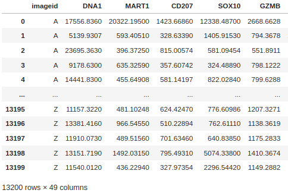

## Randkluft – Help Guide

---

### **Quick start**
1. Upload a CSV file  
2. Wait for **“File is ready for use”**  
3. Click **Randkluft**  
4. Review and adjust gates  
5. Download results  

---

## **1. Upload file**

Randkluft expects a **cell-by-marker CSV table**.

### Example input format

### Required columns
- **Sample identifiers**
  - Either `imageid` or `patient` (used to distinguish samples)
- **Spatial coordinates**
  - `x` and `y` centroid coordinates
- **Marker intensities**
  - One or more marker columns (e.g. CD3, CD20, PD1, etc.)

### Important notes
- If your file contains multiple patients or images, Randkluft automatically groups them using the `imageid` or `patient` column.
- DNA / Hoechst markers are **automatically masked and excluded from gating**.
- A reference input file can be downloaded from the **Upload file** tab.

---

## **2. Run Randkluft (automatic gating)**

After uploading your file:

1. Wait for the notification  
   **“File is ready for use”**  
   (shown as a small notice in the bottom-right corner).

2. Navigate to the **Randkluft** tab.
   - All detected markers will appear automatically.
   - By default, all markers are selected and ready for gating.

3. Review the marker list.
   - Deselect any markers you do not want to gate.

4. Click the **Randkluft** button.
   - A progress bar appears in the bottom-right corner showing  
     **“Randkluft in action”** with percentage completion.

5. When gating is complete:
   - A confirmation notice appears:  
     **“Gates are found!”**

---

## **3. Visual inspection and manual adjustment**

To inspect and refine gates:

- Enable **“Show gate”**.
- Marker histograms will be generated automatically.
- A notice **“Generating plot…”** appears while plots are rendered.

You can:
- Select markers and patients to inspect
- Visually assess the estimated gates
- Manually adjust gate values using numeric input

Updated gates are applied immediately to downstream analysis.

---

## **4. Download results**

Once you are satisfied with the gates:

### Available downloads
- **Gate estimates (CSV)**  
  A table containing the estimated gate value for each marker  
  (and each patient, if applicable).

- **Histogram plots (PDF)**  
  A PDF file containing all generated marker histograms.

- **Current plots**  
  Download only the plots currently displayed in the app.

These outputs are suitable for downstream analysis, reporting, and reproducibility.

---

## **Tips**
- If gating finishes instantly without results, the marker distribution may already be negatively skewed.
- In such cases, visual inspection and manual gating are recommended.
- For best performance, ensure marker columns contain numeric values and minimal missing data.

---

For additional details, troubleshooting, and conceptual background, please consult the **FAQ** and **Contact** sections.